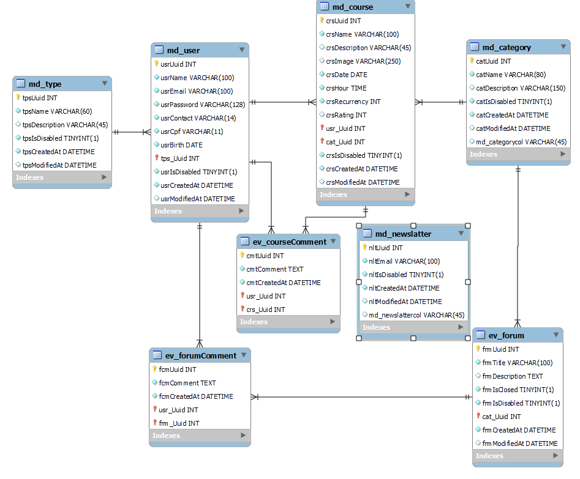

# NaCuca
O **NaCuca** é o site que vai ajudar a população de Embu-Guaçu a se estruturar profissionalmente, aumentar a sua renda e a se tornar referência em sua área de atuação dentro de sua comunidade.

O **NaCuca** acredita que todos merecem a oportunidade de crescer, aprender e se desenvolver, e estamos comprometidos em criar um ambiente inclusivo onde isso seja possível. Nosso objetivo é transformar vidas, conectar a comunidade e oferecer oportunidades para todos alcançarem seu pleno potencial. Junte-se a nós nesta jornada de aprendizado, desenvolvimento e conexão!

site: "https://giulia05tomaz.github.io/nacuca/index.html"

## Uso
1. Para test, use o login: .

2. Após isso, acesse a plataforma e faça a inscrição em um workshop caso seja um aluno.

3. Caso seja um parceiro, acesse a plataforma como parceiro, e escolha o plano que deseja de parceria.

4. Caso seja educador, pode acompanhar as aulas em alta, e adicionar mais cursos.

## Diagrama de entidade e relacionamento

## Figma

https://www.figma.com/file/O6E4bHy2kiD2ywABrqbids/Untitled?type=design&node-id=0%3A1&mode=design&t=34yTQC62baltvk3E-1

## Contribuição

Caso deseje contribuir, entre em contato conosco: +55 (11) 940897882.

## E-mail's para contato: ## 

**Giulia:** giulia05tomaz@gmail.com

**Thaís:** thaishagler@gmail.com

**Vinícius:** vinicius.silva@prometeon.com

**Mateus:** mateus.bezerra@prometeon.com

## Colaboradores

Giulia Moraes

Thaís Hagler

Vinicius Herrera

Mateus Marinho

## Licença

Licença de Software de Código Fechado

Este software é protegido por direitos autorais e é fornecido sob os termos desta Licença de Software de Código Fechado (doravante denominada "Licença"). A instalação e o uso deste software indicam seu consentimento com os termos desta Licença.

1. Licença de Uso:
   1.1. Este software é licenciado e não vendido.
   1.2. O titular dos direitos autorais deste software (doravante denominado "Licenciante") concede a você (doravante denominado "Licenciado") uma licença não exclusiva e intransferível para usar o software de acordo com os termos e condições desta Licença.

2. Restrições:
   2.1. Você não tem permissão para:
        a) Copiar, distribuir ou redistribuir este software, no todo ou em parte.
        b) Realizar engenharia reversa, descompilar ou desmontar o software.
        c) Modificar, adaptar ou criar trabalhos derivados deste software.
   2.2. Qualquer violação das restrições acima resultará na rescisão imediata desta Licença.

3. Atualizações e Suporte:
   3.1. O Licenciante pode, a seu critério, fornecer atualizações ou suporte para este software, mas não tem a obrigação de fazê-lo.

4. Direitos Autorais:
   4.1. Este software é protegido por leis de direitos autorais e tratados internacionais de propriedade intelectual.
   4.2. Todos os direitos autorais e outros direitos de propriedade intelectual neste software são de propriedade exclusiva do Licenciante.

5. Rescisão:
   5.1. Esta Licença será rescindida automaticamente em caso de violação de qualquer uma das suas disposições.
   5.2. Após a rescisão, o Licenciado deve cessar imediatamente o uso deste software e destruir todas as cópias em sua posse.

6. Isenção de Garantias:
   6.1. Este software é fornecido "no estado em que se encontra" e sem garantias de qualquer tipo, expressas ou implícitas.
   6.2. O Licenciante não garante que este software seja livre de erros ou que atenda aos requisitos específicos do Licenciado.

7. Limitação de Responsabilidade:
   7.1. O Licenciante não será responsável por quaisquer danos diretos, indiretos, incidentais, especiais, exemplares ou consequentes resultantes do uso ou da incapacidade de usar este software, mesmo que o Licenciante tenha sido informado sobre a possibilidade de tais danos.

8. Lei Aplicável:
   8.1. Esta Licença será regida e interpretada de acordo com as leis do [inserir jurisdição] sem considerar conflitos de princípios legais.

9. Aceitação:
   9.1. Ao usar este software, o Licenciado indica sua aceitação dos termos e condições desta Licença.

Este é um contrato legal entre o Licenciante e o Licenciado. Ao utilizar este software, você concorda em cumprir os termos desta Licença.

