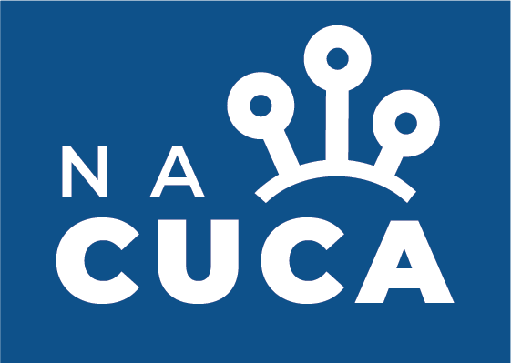
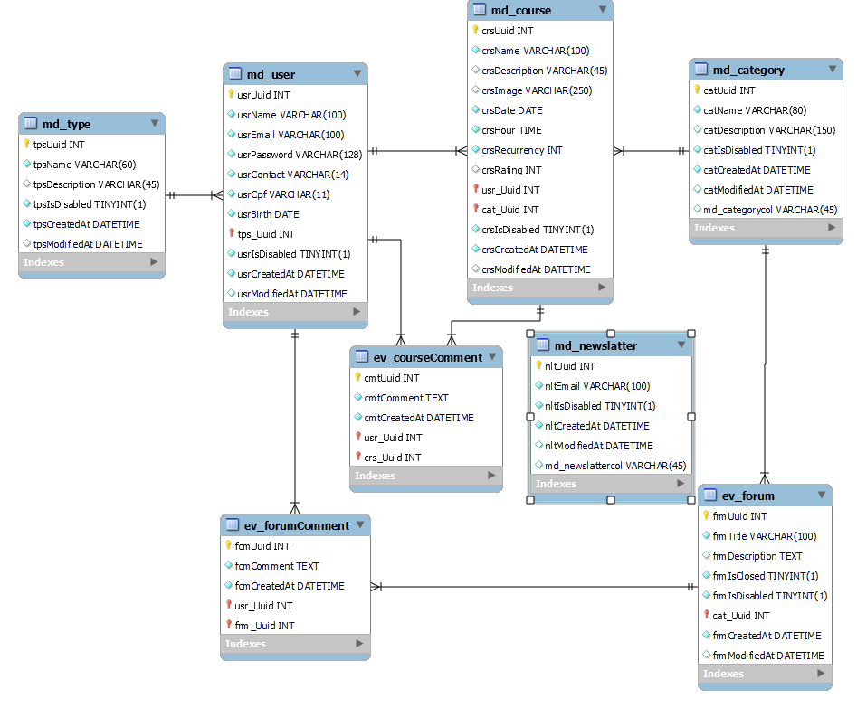
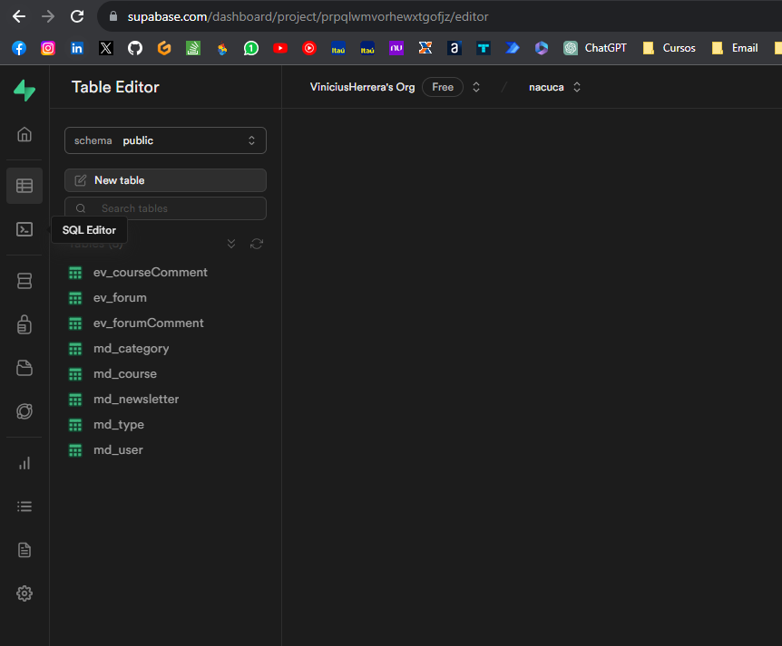

# Na Cuca

Protótipo de plataforma comunitária voltada a workshops e oportunidades de desenvolvimento profissional em Embu-Guaçu. O repositório reúne páginas para alunos, educadores e parceiros, materiais de apresentação e documentação de dados.

> **Status:** protótipo de frontend. O arquivo `backend/main.py` é um rascunho incompleto, com instruções de instalação dentro do código e um import incorreto de FastAPI. Ele não representa uma API executável. Cadastro, inscrição e gestão de cursos não devem ser tratados como serviços completos nesta versão.

## Interface e objetivo

- Páginas de apresentação, cadastro, alunos, educadores e parceiros.
- Seções de encontros, navegação, carrosséis e recursos visuais em JavaScript.
- Materiais históricos do modelo de dados e do desenho da interface.

O objetivo do protótipo é apresentar os fluxos e a proposta da plataforma. Parte dos formulários e links depende de implementação adicional.

## Tecnologias e arquitetura

| Área | Presente no repositório |
| --- | --- |
| Frontend | HTML, CSS, JavaScript, Bootstrap e jQuery |
| Componentes visuais | Owl Carousel, Isotope, Lightbox e scripts de navegação |
| Dados | Script SQL e diagramas; materiais históricos referentes ao Supabase |
| Backend | Rascunho Python/FastAPI incompleto |

As páginas e os assets são servidos como arquivos estáticos. O repositório não fornece um backend funcional integrado, testes automatizados ou workflow de GitHub Actions.

## Execução local

Não é necessário instalar dependências npm para visualizar o frontend. Com Git e Python 3 instalados:

```sh
git clone https://github.com/giulia05tomaz/nacuca.git
cd nacuca
python -m http.server 8000 --bind 127.0.0.1
```

Abra `http://127.0.0.1:8000/index.html`. Esse comando serve somente os arquivos do protótipo; não habilita autenticação ou persistência dos formulários.

## Estrutura

```text
index.html           página inicial
cadastro.html        tela de cadastro
aluno.html           área de aluno
educadores.html      área de educador
Parceiros.html       área de parceiros
assets/              estilos, scripts, imagens e fontes
vendor/              bibliotecas de frontend
backend/main.py      rascunho de backend
backend/db_nacuca.sql material de estrutura de dados
```

## Materiais existentes



| Modelo de dados | Material do Supabase |
| --- | --- |
|  |  |

As imagens registram o desenho do projeto e não comprovam uma integração atualmente operacional.

[Protótipo no Figma](https://www.figma.com/file/O6E4bHy2kiD2ywABrqbids/Untitled)

## Validação e próximos passos

A validação disponível é manual: navegação, carregamento de assets e comportamento responsivo. Antes de evoluir o backend, separar instruções de instalação do código, corrigir os imports, definir dependências e implementar endpoints, persistência e testes.

## Colaboradores

Giulia Moraes · Thaís Hagler · Vinicius Herrera · Mateus Marinho


## Licença

Licença de Software de Código Fechado

Este software é protegido por direitos autorais e é fornecido sob os termos desta Licença de Software de Código Fechado (doravante denominada "Licença"). A instalação e o uso deste software indicam seu consentimento com os termos desta Licença.

1. Licença de Uso:
   1.1. Este software é licenciado e não vendido.
   1.2. O titular dos direitos autorais deste software (doravante denominado "Licenciante") concede a você (doravante denominado "Licenciado") uma licença não exclusiva e intransferível para usar o software de acordo com os termos e condições desta Licença.

2. Restrições:
   2.1. Você não tem permissão para:
        a) Copiar, distribuir ou redistribuir este software, no todo ou em parte.
        b) Realizar engenharia reversa, descompilar ou desmontar o software.
        c) Modificar, adaptar ou criar trabalhos derivados deste software.
   2.2. Qualquer violação das restrições acima resultará na rescisão imediata desta Licença.

3. Atualizações e Suporte:
   3.1. O Licenciante pode, a seu critério, fornecer atualizações ou suporte para este software, mas não tem a obrigação de fazê-lo.

4. Direitos Autorais:
   4.1. Este software é protegido por leis de direitos autorais e tratados internacionais de propriedade intelectual.
   4.2. Todos os direitos autorais e outros direitos de propriedade intelectual neste software são de propriedade exclusiva do Licenciante.

5. Rescisão:
   5.1. Esta Licença será rescindida automaticamente em caso de violação de qualquer uma das suas disposições.
   5.2. Após a rescisão, o Licenciado deve cessar imediatamente o uso deste software e destruir todas as cópias em sua posse.

6. Isenção de Garantias:
   6.1. Este software é fornecido "no estado em que se encontra" e sem garantias de qualquer tipo, expressas ou implícitas.
   6.2. O Licenciante não garante que este software seja livre de erros ou que atenda aos requisitos específicos do Licenciado.

7. Limitação de Responsabilidade:
   7.1. O Licenciante não será responsável por quaisquer danos diretos, indiretos, incidentais, especiais, exemplares ou consequentes resultantes do uso ou da incapacidade de usar este software, mesmo que o Licenciante tenha sido informado sobre a possibilidade de tais danos.

8. Lei Aplicável:
   8.1. Esta Licença será regida e interpretada de acordo com as leis do [inserir jurisdição] sem considerar conflitos de princípios legais.

9. Aceitação:
   9.1. Ao usar este software, o Licenciado indica sua aceitação dos termos e condições desta Licença.

Este é um contrato legal entre o Licenciante e o Licenciado. Ao utilizar este software, você concorda em cumprir os termos desta Licença.
